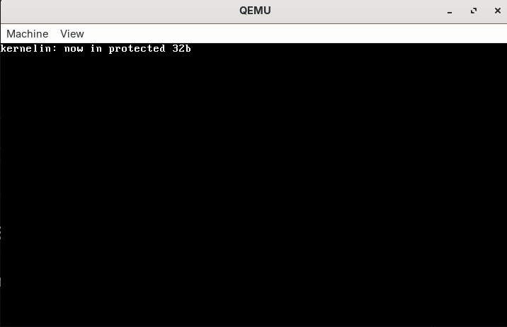

# bootloader kernelin
## loader writed on assembler launguage.

## loader can:
walk from 16 bits real mode, to 32 bits protected mode,

can be useful for your miniOS.

## license
mit license on this project.

## scripts

